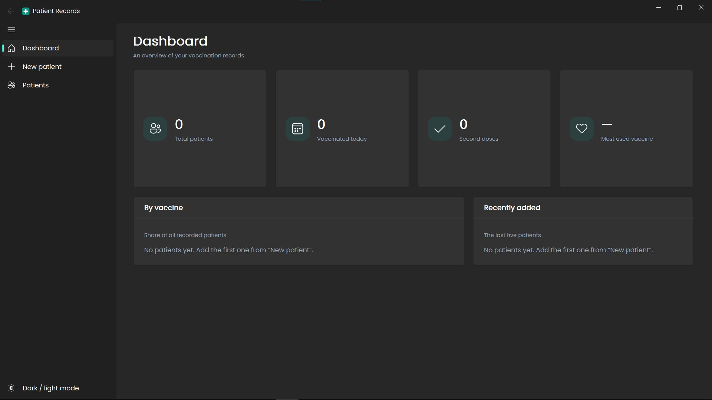
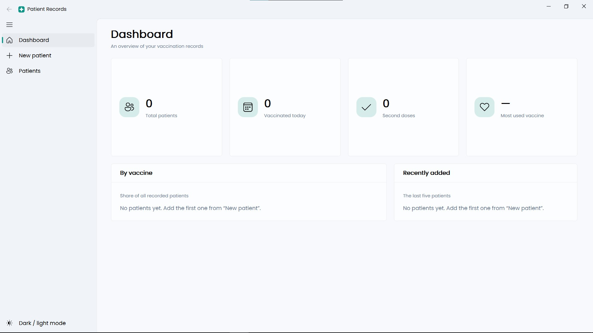

# Patient Records

**A desktop app for collecting and managing COVID-19 vaccination records.**

[](https://github.com/djalilhalisse/Patient-Records-App/releases/latest)
[](https://github.com/djalilhalisse/Patient-Records-App/releases/latest)

Patient Records is a Windows desktop application built with **Python, PyQt5 and Fluent Widgets**. It replaces paper forms with a fast, validated data-entry form, a searchable patient table and a dashboard of totals and vaccine breakdowns. It was built for, and is in use at, **EPSP Annaba**.

Records are stored in plain **CSV files**, so the data stays easy to open in Excel and to feed into analysis tools.

## Screenshots

**Dark mode**



**Light mode**



## Features

- **Dashboard**: total patients, vaccinated today, second doses, most used vaccine, share of patients by vaccine, and the five most recently added patients
- **New patient form** with a guided layout and clear inline error messages
- **Strict validation**: 20-digit ID number with duplicate detection, age 1 to 120, phone number format, required fields, no future vaccination dates, and a check that the vaccine was not already expired on the vaccination date
- **Medical history checklist** (antecedents) with the option to add your own entries
- **Editable lists**: vaccines and vaccination locations can be typed in and are remembered for next time
- **Patients table**: sortable columns, instant search across every field, edit (also by double-click) and delete with confirmation
- **Export to CSV**, UTF-8 with BOM so Arabic and French characters display correctly in Excel
- **Dark and light mode**, remembered between sessions
- **Keyboard shortcuts**: `Ctrl+S` to save the form, `Ctrl+F` to jump to search
- **Crash-safe storage**: files are written atomically, so a crash or power cut cannot corrupt the records
- **Friendly errors**: file problems show a readable message instead of crashing the app

## Recorded data

Each patient record contains:

`ID Number` · `Name` · `Gender` · `Age` · `Address` · `Phone` · `Vaccine` · `Lot Number` · `Expiry Date` · `Vaccination Location` · `Vaccination Date` · `Vaccination Time` · `Administration Site` · `Dose` · `Antecedents`

## Tech stack

| Layer | Technology |
|---|---|
| Language | Python 3 |
| UI | PyQt5 with [PyQt-Fluent-Widgets](https://github.com/zhiyiYo/PyQt-Fluent-Widgets) |
| Storage | CSV files (standard library `csv`) |
| Packaging | PyInstaller |
| Font | Poppins |

## Getting started

### Option 1: Run the packaged app (Windows)

Download the latest release, unzip it, and run `PatientRecords.exe`. No Python installation is needed.

### Option 2: Run from source

```bash
git clone https://github.com/djalilhalisse/Patient-Records-App.git
cd Patient-Records-App

pip install PyQt5 "PyQt-Fluent-Widgets"
python PatientRecordsApp.py
```

### Build the executable

```bash
pip install pyinstaller
pyinstaller --noconfirm --windowed --name PatientRecords ^
  --add-data "fonts;fonts" --add-data "data;data" PatientRecordsApp.py
```

The result is in `Releases/Patient-Records-App/`.

## Where the data is stored

The app saves everything in a `data/` folder **next to the executable** (or next to the script when running from source):

| File | Content |
|---|---|
| `patients_data.csv` | The patient records |
| `vaccines.csv` | Vaccine list |
| `locations.csv` | Vaccination locations |
| `antecedents_list.csv` | Medical history checklist |

On first launch, the starter lists in `data/` are copied if they are missing. To back up your records, copy this folder.

## Customisation

Settings are at the top of `PatientRecordsApp.py`:

- `ID_LENGTH`: length of the ID number (default 20)
- `ACCENT`: accent colour (default teal `#0d9488`)
- `FONT_FAMILY`: font used by the app (put the `.ttf` files in `fonts/`)
- `DEFAULT_VACCINES`, `DEFAULT_LOCATIONS`, `DEFAULT_ANTECEDENTS`: starting lists

## Project structure

```
Patient-Records-App/
├── PatientRecordsApp.py   # The whole application
├── data/                  # CSV data and starter lists
└── fonts/                 # Poppins font
```

## Privacy

This app handles personal health data. **Never commit real patient records to a public repository.** Keep `data/patients_data.csv` out of version control (add it to `.gitignore`) and protect the machine it runs on according to your establishment's rules.

## Author

**Abdeldjalil Halisse**: AI Engineer, Université Badji Mokhtar, Annaba.
GitHub: [@djalilhalisse](https://github.com/djalilhalisse)

## License

MIT License

Copyright (c) 2026 Abdeldjalil Halisse

Permission is hereby granted, free of charge, to any person obtaining a copy
of this software and associated documentation files (the "Software"), to deal
in the Software without restriction, including without limitation the rights
to use, copy, modify, merge, publish, distribute, sublicense, and/or sell
copies of the Software, and to permit persons to whom the Software is
furnished to do so, subject to the following conditions:

The above copyright notice and this permission notice shall be included in all
copies or substantial portions of the Software.

THE SOFTWARE IS PROVIDED "AS IS", WITHOUT WARRANTY OF ANY KIND, EXPRESS OR
IMPLIED, INCLUDING BUT NOT LIMITED TO THE WARRANTIES OF MERCHANTABILITY,
FITNESS FOR A PARTICULAR PURPOSE AND NONINFRINGEMENT. IN NO EVENT SHALL THE
AUTHORS OR COPYRIGHT HOLDERS BE LIABLE FOR ANY CLAIM, DAMAGES OR OTHER
LIABILITY, WHETHER IN AN ACTION OF CONTRACT, TORT OR OTHERWISE, ARISING FROM,
OUT OF OR IN CONNECTION WITH THE SOFTWARE OR THE USE OR OTHER DEALINGS IN THE
SOFTWARE.
